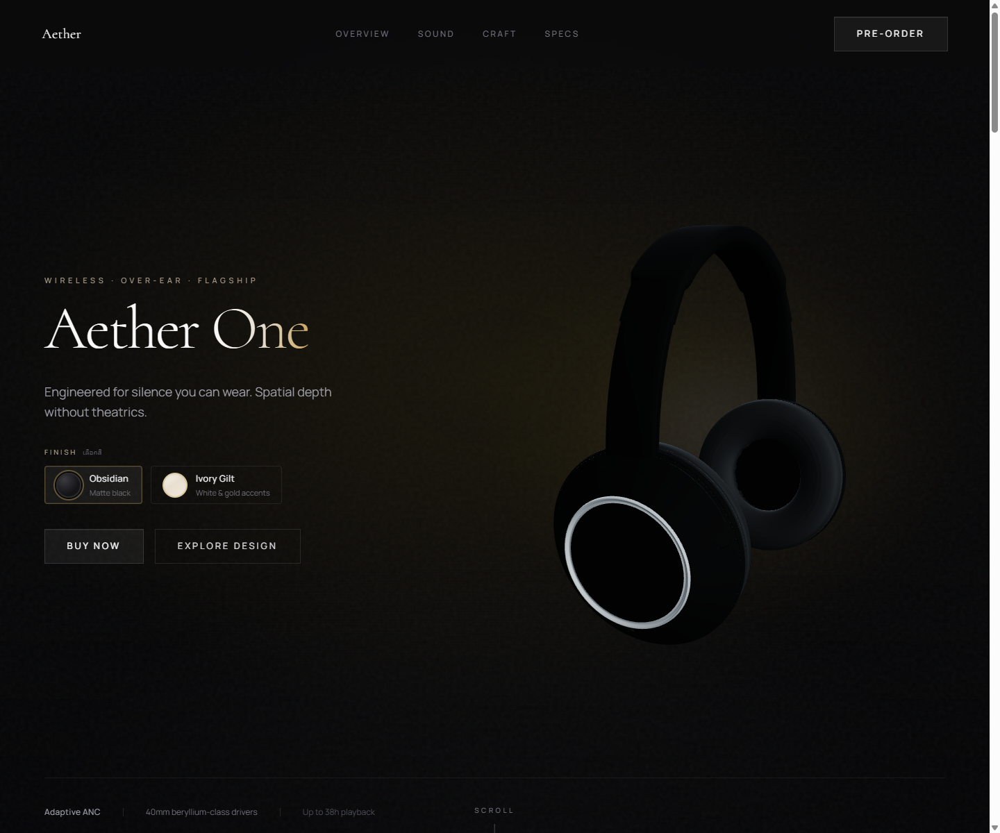

# Aether One

Immersive product landing page for a premium wireless headphone concept, built to showcase high-end motion design, responsive layout work, and a scroll-linked 3D product experience.



## Overview

Aether One is a portfolio piece focused on translating a luxury hardware brand direction into a polished web experience. The project combines editorial-style layout, subtle motion, and a Three.js product stage that stays integrated with the page narrative instead of feeling bolted on.

## What This Project Shows

- Cinematic landing-page art direction with a premium product focus
- Scroll-linked 3D composition built with React Three Fiber and Drei
- Shared product finish state between UI controls and the rendered model
- Responsive layouts tuned separately for desktop and mobile storytelling
- Reusable section/component structure instead of a one-file marketing page

## Stack

- Next.js 16
- React 19
- TypeScript
- Tailwind CSS 4
- Framer Motion
- Three.js
- React Three Fiber
- Drei

## Technical Highlights

- The hero and overview states are connected through a scroll-driven interpolation layer rather than isolated scenes, which keeps the transition feeling continuous.
- Product finish selection is centralized in shared state so the UI and 3D presentation stay synchronized.
- Motion is layered with restraint: reveal timing, ambient backgrounds, and section transitions support the product instead of competing with it.
- The page is structured into reusable sections and product-specific primitives to keep iteration manageable as the experience grows.

## Local Development

```bash
npm install
npm run dev
```

Open [http://localhost:3000](http://localhost:3000).

## Validation

```bash
npm run lint
npm run build
```

## Project Structure

- `src/app` for the app shell, metadata, and global styling
- `src/components/home` for responsive page orchestration
- `src/components/sections` for content sections
- `src/components/product` for the 3D product stage and scroll-linked behavior
- `src/components/ui` for shared presentation and motion primitives
- `public/models` for product model assets
